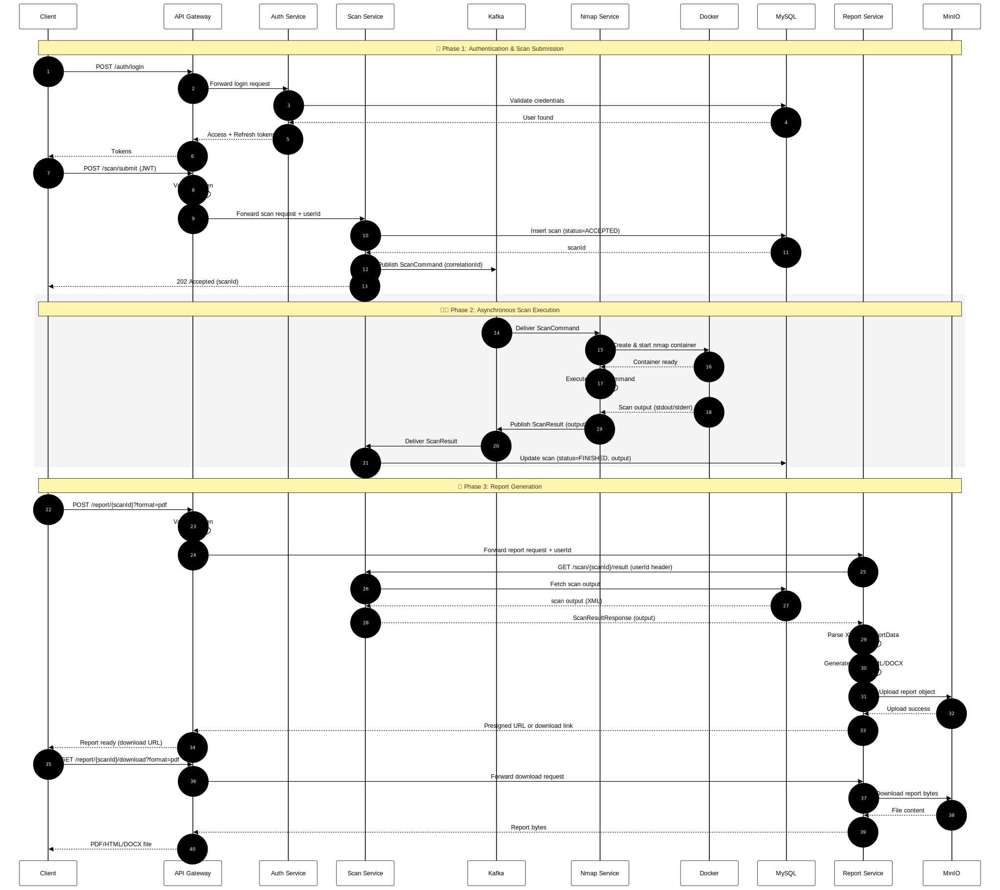

## Sentinel — Vulnerability Assessment Platform

A distributed, microservices-based vulnerability assessment platform that allows security professionals and developers
to run Nmap network scans, manage results, and generate detailed reports all through a secure, authenticated REST API.

---

### What it does

Users register, verify their email, and log in. Once authenticated, they configure a network scan choosing the target,
scan type, port range, OS detection, and service version detection. The scan request is submitted through the API
Gateway and processed **asynchronously**: a Kafka pipeline decouples the request intake from the actual scan execution,
allowing multiple users to run concurrent scans without blocking.

A dedicated Nmap service consumes scan jobs from Kafka, dynamically spins up an ephemeral Docker container running Nmap,
executes the scan, captures the output, and publishes results back through Kafka. The scan service persists results to
MySQL. Users can then request a report for any completed scan, which is generated in their chosen format (PDF, HTML, or
DOCX) and stored in MinIO object storage downloadable via the report service.

---

### Architecture



### Flow Diagram


---

### Services

| Service          | Port | Responsibility                                                                                             |
|------------------|------|------------------------------------------------------------------------------------------------------------|
| `api-gateway`    | 7777 | Single entry point. JWT validation, load-balanced routing via Eureka, request ID tracing                   |
| `auth-service`   | 8083 | User registration, email verification, JWT access + refresh tokens, token blacklisting, logout             |
| `scan-service`   | 8081 | Accepts scan requests, publishes to Kafka, persists results from Kafka, exposes scan query APIs            |
| `nmap-service`   | 8082 | Consumes scan jobs from Kafka, builds Nmap command, spins up ephemeral Docker container, publishes results |
| `report-service` | 8085 | Fetches scan results from scan-service, generates reports, uploads to MinIO, serves downloads              |
| `eureka-server`  | 8761 | Netflix Eureka service registry for service discovery                                                      |

---

## Tech Stack

- **Java 17**, **Spring Boot 3**, **Spring Cloud 2025**
- **Spring Cloud Gateway** (WebFlux-based reactive gateway)
- **Spring Security + JJWT 0.12.6** — JWT auth with access/refresh token lifecycle
- **Apache Kafka** (KRaft mode, no Zookeeper) — async scan pipeline
- **docker-java 3.7.0** — programmatic Docker container lifecycle management
- **MySQL 8** — persistent storage, schema initialized via `init.sql`
- **MinIO** — S3-compatible object storage for report files
- **Netflix Eureka** — service discovery and client-side load balancing
- **Docker + Docker Compose** — full containerization with health checks and dependency ordering
- **smtp4dev** — local SMTP server for email verification in development

---

## Key Design Decisions

**Why Kafka instead of direct HTTP calls between scan-service and nmap-service?**

Nmap scans are slow — a full port scan can take minutes. A synchronous HTTP call would block the scan-service thread for
the entire duration, making the system unable to handle concurrent users. Kafka decouples the two services completely:
scan-service publishes a job and immediately returns a scan ID to the user. The nmap-service processes jobs
independently, at its own pace, with a thread pool handling up to 20 concurrent scans. Results flow back through a
separate Kafka topic.

**Why does the API Gateway handle JWT validation instead of each service?**

Centralised enforcement. If each service independently validated tokens, every service would need the JWT secret,
validation logic, and blacklist access. The gateway is the single entry point — only verified, non-blacklisted requests
pass through. Downstream services trust the gateway completely.

**Why ephemeral Docker containers for Nmap?**

Nmap requires raw network access (`CAP_NET_RAW`) and running it in an isolated container per scan prevents any scan from
affecting the host or other scans. Containers are created, used, and deleted — no state bleeds between runs.

**Why MinIO instead of saving reports to disk?**

Saving files to a service's local filesystem breaks in a containerized environment — restarts lose data. MinIO provides
persistent, S3-compatible object storage that survives container restarts and scales independently of the application
services.

---

## Scan Options

When submitting a scan, users can configure:

- **Target** — IP address or hostname
- **Scan type** — SYN scan, TCP connect, UDP, ping, etc.
- **Port range** — top 100, top 1000, or custom
- **OS detection** — enabled/disabled
- **Service version detection** — enabled/disabled
- **Protocol** — TCP/UDP

---

## API Overview

All requests (except registration, login, and email verification) go through the API Gateway at `http://localhost:7777`.

**Auth**

```
POST /api/v1/auth/register          Register new user
POST /api/v1/auth/verify-email      Verify email with token
POST /api/v1/auth/login             Login → returns access + refresh token
POST /api/v1/auth/refresh           Refresh access token
POST /api/v1/auth/logout            Invalidate token (blacklist)
GET  /api/v1/users/{id}             Get user profile
```

**Scans**

```
POST /api/v1/scan/request           Submit a new scan
GET  /api/v1/scan/{id}              Get scan details by ID
GET  /api/v1/scan/{id}/status       Get scan status
GET  /api/v1/scan/user/{userId}     Get all scans for a user
```

**Reports**

```
POST /api/v1/report/generate/{scanId}?format=PDF    Generate report
GET  /api/v1/report/download/{scanId}?format=PDF    Download report
```

---

### Running Locally

### Prerequisites

- Docker Desktop (or Docker Engine + Compose)
- Java 17+
- Maven 3.8+

#### Steps

**1. Clone the repository**

```bash
git clone https://github.com/YOUR_USERNAME/sentinel.git
cd sentinel
```

**2. Configure environment**

```bash
cp .env.example.example .env.example
# Edit .env.example and set JWT_SECRET_KEY to a Base64-encoded 256-bit key
# Generate one with: openssl rand -base64 32
```

**3. Build all services**

```bash
mvn clean package -DskipTests
```

**4. Start the full stack**

```bash
docker compose up --build
```

Services start in order: MySQL and Kafka first, then Eureka, then the API Gateway, then all application services. Full
startup takes ~2-3 minutes on first run (image pulls).

**5. Verify everything is up**

- Eureka dashboard: http://localhost:8761
- MinIO console: http://localhost:9001 (sentinel / sentinel123)
- Email UI (smtp4dev): http://localhost:5000
- API Gateway health: http://localhost:7777/actuator/health

### Quick Test Flow

```
1. Register:   POST http://localhost:7777/api/v1/auth/register
2. Verify:     Check http://localhost:5000 for the verification email, click the link
3. Login:      POST http://localhost:7777/api/v1/auth/login  → copy the accessToken
4. Scan:       POST http://localhost:7777/api/v1/scan/request  (Authorization: Bearer <token>)
5. Status:     GET  http://localhost:7777/api/v1/scan/{scanId}/status
6. Report:     POST http://localhost:7777/api/v1/report/generate/{scanId}?format=PDF
7. Download:   GET  http://localhost:7777/api/v1/report/download/{scanId}?format=PDF
```

HTTP request files for IntelliJ/VS Code are included in `/http-requests/`.

---

### Project Structure

```
Sentinel/
├── api-gateway/          Spring Cloud Gateway + JWT filter
├── assets/               Assets folder
├── auth-service/         Registration, login, JWT, email verification
├── scan-service/         Scan request intake and result persistence
├── nmap-service/         Kafka consumer, Docker orchestration, Nmap execution
├── report-service/       Report generation (PDF/HTML/DOCX) + MinIO storage
├── eureka-server/        Service registry
├── mysql-init/           DB schema initialisation (init.sql)
├── http-requests/        IntelliJ HTTP client request files for testing
├── docker-compose.yml    Full stack orchestration
├── Dockerfile            Multi-service build (SERVICE_NAME build arg)
└── pom.xml               Parent Maven POM
```

---

### Known Limitations & Future Improvements

- No frontend UI — API only (REST client / IntelliJ HTTP files provided)
- Not fully covered by automated tests — manual testing via HTTP files
- Single Kafka broker (replication factor 1) — not production-grade for HA
- Nmap scan requires Docker socket mount — needs careful consideration in production environments
- JWT key rotation not yet implemented
- Prometheus/Grafana metrics integration is stubbed but not enabled

---

#### Author

**Shaik Zayed** · [LinkedIn](https://linkedin.com/in/shaik-zayed) · [Portfolio](https://shaiks.vercel.app)