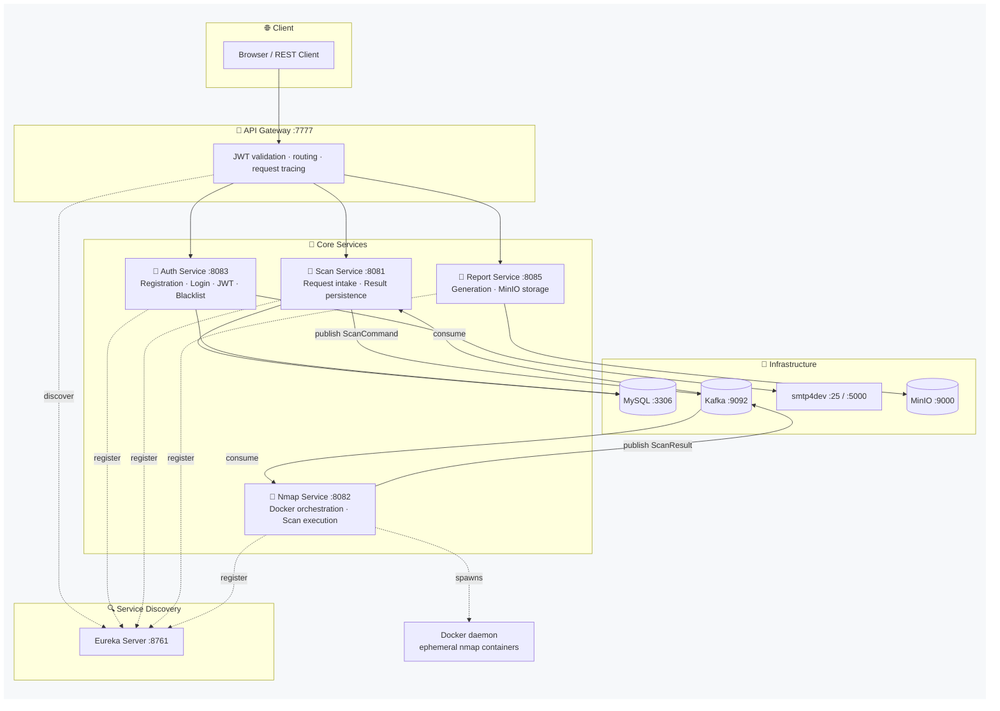
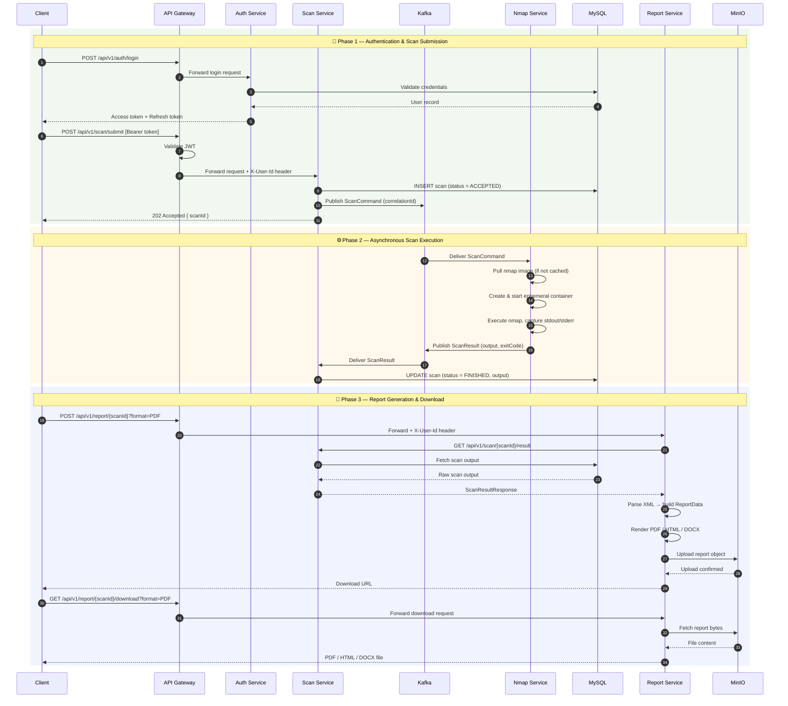

# Sentinel

> Distributed vulnerability assessment platform — authenticated Nmap scanning, async execution, and multi-format report
> generation via a microservices REST API.


---

## Overview

Users register, verify their email, and log in. Once authenticated, they configure a network scan — choosing the target,
scan mode, port range, protocol, OS detection, and service version detection. The request is submitted through the API
Gateway and processed **asynchronously**: a Kafka pipeline fully decouples request intake from scan execution, allowing
multiple users to run concurrent scans without blocking.

A dedicated Nmap service consumes scan jobs from Kafka, spins up an ephemeral Docker container, executes the scan,
captures output, and publishes results back through Kafka. The scan service persists results to MySQL. Users can then
request a report for any completed scan — generated as PDF, HTML, or DOCX — stored in MinIO and downloadable via the
report service.

---

## Architecture



---

## Request Flow



---

## Services

| Service          | Port | Responsibility                                                                                             |
|------------------|------|------------------------------------------------------------------------------------------------------------|
| `api-gateway`    | 7777 | Single entry point — JWT validation, load-balanced routing via Eureka, request ID tracing                  |
| `auth-service`   | 8083 | Registration, email verification, JWT access + refresh tokens, token blacklisting, password reset          |
| `scan-service`   | 8081 | Accepts scan requests, publishes to Kafka, persists results, exposes query and status APIs                 |
| `nmap-service`   | 8082 | Consumes scan jobs from Kafka, builds Nmap command, manages ephemeral Docker containers, publishes results |
| `report-service` | 8085 | Fetches scan results, generates reports (PDF/HTML/DOCX), uploads to MinIO, serves downloads                |
| `eureka-server`  | 8761 | Netflix Eureka service registry — service discovery and client-side load balancing                         |

---

## Tech Stack

| Category             | Technology                                                      |
|----------------------|-----------------------------------------------------------------|
| Language             | Java 21 (source compatibility: Java 17)                         |
| Framework            | Spring Boot 4.0 · Spring Cloud 2025                             |
| API Gateway          | Spring Cloud Gateway (WebFlux reactive)                         |
| Auth                 | Spring Security + JJWT 0.12.6 — access/refresh token lifecycle  |
| Messaging            | Apache Kafka (KRaft mode — no Zookeeper)                        |
| Container Management | docker-java 3.7.0 — programmatic Docker container lifecycle     |
| Database             | MySQL 8 — schema initialised via `init.sql`                     |
| Object Storage       | MinIO (S3-compatible)                                           |
| Service Discovery    | Netflix Eureka                                                  |
| Infrastructure       | Docker + Docker Compose — health checks and dependency ordering |
| Dev Email            | smtp4dev — local SMTP server + web UI                           |

---

## Design Decisions

**Why Kafka instead of direct HTTP between scan-service and nmap-service?**

Nmap scans are slow — a full port scan can take minutes. A synchronous HTTP call would block the scan-service thread for
the entire duration, making the system unable to handle concurrent users. Kafka decouples the two services completely:
scan-service publishes a job and immediately returns a scan ID. The nmap-service processes jobs independently with a
thread pool handling up to 20 concurrent scans. Results flow back through a separate Kafka topic.

**Why does the API Gateway handle JWT validation instead of each service?**

Centralised enforcement. If each service independently validated tokens, every service would need the JWT secret,
validation logic, and blacklist access. The gateway is the single entry point — only verified, non-blacklisted requests
pass through. Downstream services trust the gateway completely.

**Why ephemeral Docker containers for Nmap?**

Nmap requires raw network access (`CAP_NET_RAW`) and running it in an isolated container per scan prevents any scan from
affecting the host or other concurrent scans. Containers are created, used, and deleted — no state bleeds between runs.

**Why MinIO instead of saving reports to disk?**

Saving files to a service's local filesystem breaks in a containerised environment — restarts lose data. MinIO provides
persistent, S3-compatible object storage that survives container restarts and scales independently of the application
services.

---

## API Reference

All endpoints (except registration, login, and email verification) require an `Authorization: Bearer <accessToken>`
header and go through the API Gateway at `http://localhost:7777`.

### Auth — `/api/v1/auth`

| Method | Endpoint               | Description                                   |
|--------|------------------------|-----------------------------------------------|
| `POST` | `/register`            | Register a new user                           |
| `POST` | `/verify-email`        | Verify email address with token               |
| `POST` | `/resend-verification` | Resend the verification email                 |
| `POST` | `/login`               | Login — returns access + refresh tokens       |
| `POST` | `/refresh`             | Exchange refresh token for a new access token |
| `POST` | `/logout`              | Invalidate current access token (blacklist)   |
| `POST` | `/logout-all-devices`  | Revoke all refresh tokens across all devices  |
| `GET`  | `/validate`            | Validate a token                              |
| `POST` | `/forgot-password`     | Initiate password reset — sends reset email   |
| `POST` | `/reset-password`      | Complete password reset with token            |

### Users — `/api/v1/users`

| Method   | Endpoint              | Description                                    |
|----------|-----------------------|------------------------------------------------|
| `GET`    | `/me`                 | Get the currently authenticated user's profile |
| `PUT`    | `/me/change-password` | Change the current user's password             |
| `GET`    | `/{id}`               | Get a user profile by ID                       |
| `GET`    | `/getAllUsers`        | List all users *(admin)*                       |
| `DELETE` | `/{id}`               | Delete a user *(admin)*                        |
| `POST`   | `/{id}/unlock`        | Unlock a locked user account *(admin)*         |

### Scans — `/api/v1/scan`

| Method   | Endpoint                  | Description                                                                  |
|----------|---------------------------|------------------------------------------------------------------------------|
| `POST`   | `/submit`                 | Submit a new scan — returns `202 Accepted` with `scanId`                     |
| `GET`    | `/{scanId}`               | Get full scan details                                                        |
| `GET`    | `/{scanId}/status`        | Poll scan status (`ACCEPTED` → `QUEUED` → `STARTED` → `FINISHED` / `FAILED`) |
| `GET`    | `/{scanId}/result`        | Get the raw scan output for a completed scan                                 |
| `GET`    | `/list?limit=20&offset=0` | Paginated list of the authenticated user's scans                             |
| `DELETE` | `/{scanId}`               | Delete a scan record                                                         |

### Reports — `/api/v1/report`

| Method | Endpoint                        | Description                                        |
|--------|---------------------------------|----------------------------------------------------|
| `POST` | `/{scanId}?format=PDF`          | Generate a report — formats: `PDF`, `HTML`, `DOCX` |
| `GET`  | `/{scanId}/formats`             | List already-generated formats cached for a scan   |
| `GET`  | `/{scanId}/download?format=PDF` | Download the generated report file                 |

---

## Running Locally

### Prerequisites

- Docker Desktop (or Docker Engine + Compose)
- Java 17+
- Maven 3.8+

### Setup

**1. Clone the repository**

```bash
git clone https://github.com/shaik-zayed/Sentinel.git
cd Sentinel
```

**2. Configure environment**

```bash
cp .env.example .env
```

Open `.env` and set `JWT_SECRET_KEY` to a Base64-encoded 256-bit key:

```bash
openssl rand -base64 32
```

**3. Build all services**

```bash
mvn clean package -DskipTests
```

**4. Start the full stack**

```bash
docker compose up --build
```

Services start in dependency order: MySQL and Kafka → Eureka → API Gateway → application services. First run takes ~2–3
minutes for image pulls.

### Verify Everything Is Up

| Service             | URL                                   | Credentials                |
|---------------------|---------------------------------------|----------------------------|
| Eureka dashboard    | http://localhost:8761                 | —                          |
| MinIO console       | http://localhost:9001                 | `sentinel` / `sentinel123` |
| Email UI (smtp4dev) | http://localhost:5000                 | —                          |
| Gateway health      | http://localhost:7777/actuator/health | —                          |

### Quick Test Flow

```
1. Register    POST  /api/v1/auth/register
2. Verify      Open  http://localhost:5000  →  click the verification link
3. Login       POST  /api/v1/auth/login     →  copy the accessToken
4. Scan        POST  /api/v1/scan/submit        Authorization: Bearer <token>
5. Poll        GET   /api/v1/scan/{scanId}/status   (until FINISHED)
6. Generate    POST  /api/v1/report/{scanId}?format=PDF
7. Download    GET   /api/v1/report/{scanId}/download?format=PDF
```

HTTP request files for IntelliJ / VS Code are in `/http-requests/`.

### Scan Request Payload

| Field                  | Type      | Values                                                     |
|------------------------|-----------|------------------------------------------------------------|
| `target`               | `string`  | IP address or hostname — e.g. `192.168.1.1`, `example.com` |
| `scanMode`             | `string`  | `LIGHT` · `DEEP`                                           |
| `protocol`             | `string`  | `TCP` · `UDP`                                              |
| `portMode`             | `string`  | `COMMON` · `LIST`                                          |
| `portValue`            | `string`  | `top-100` · `top-1000` · custom e.g. `80,443,8080`         |
| `detectOs`             | `boolean` | `true` · `false`                                           |
| `detectServiceVersion` | `boolean` | `true` · `false`                                           |

---

## Project Structure

```
Sentinel/
├── api-gateway/          Spring Cloud Gateway + JWT validation filter
├── auth-service/         Registration, login, JWT lifecycle, email verification, password reset
├── scan-service/         Scan request intake, Kafka producer/consumer, result persistence
├── nmap-service/         Kafka consumer, Docker container orchestration, Nmap execution
├── report-service/       Report generation (PDF/HTML/DOCX) + MinIO upload and download
├── eureka-server/        Netflix Eureka service registry
├── mysql-init/           Database schema initialisation (init.sql)
├── assets/               Architecture and flow diagrams (.mmd source + .svg renders)
├── http-requests/        IntelliJ HTTP client request files for manual testing
├── docker-compose.yml    Full stack orchestration with health checks
├── Dockerfile            Multi-service layered build (SERVICE_NAME build arg)
└── pom.xml               Parent Maven POM
```

---

## Known Limitations

- No frontend UI — API only (IntelliJ HTTP request files provided for testing)
- Limited automated test coverage — manual testing via HTTP files
- Single Kafka broker with replication factor 1 — not production-grade for high availability
- Docker socket mount required for Nmap containers — review security implications before deploying to production
- JWT key rotation not yet implemented
- Prometheus / Grafana metrics integration stubbed but not enabled

---

## Author

**Shaik Zayed** · [LinkedIn](https://linkedin.com/in/shaik-zayed) · [Portfolio](https://shaiks.vercel.app)